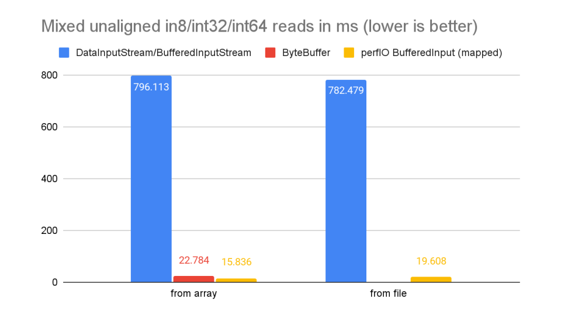
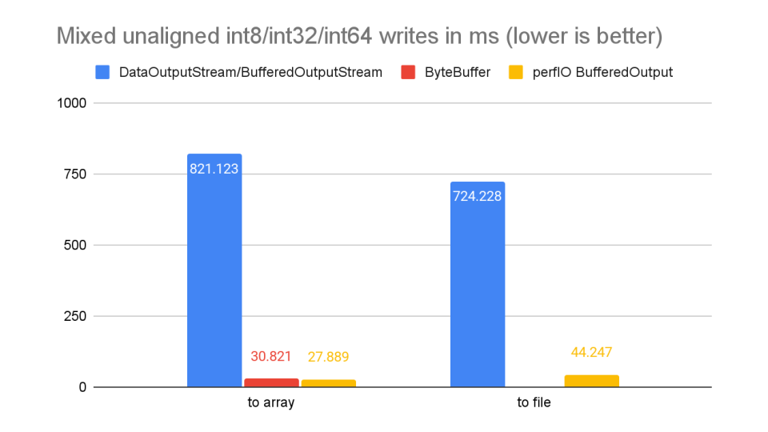
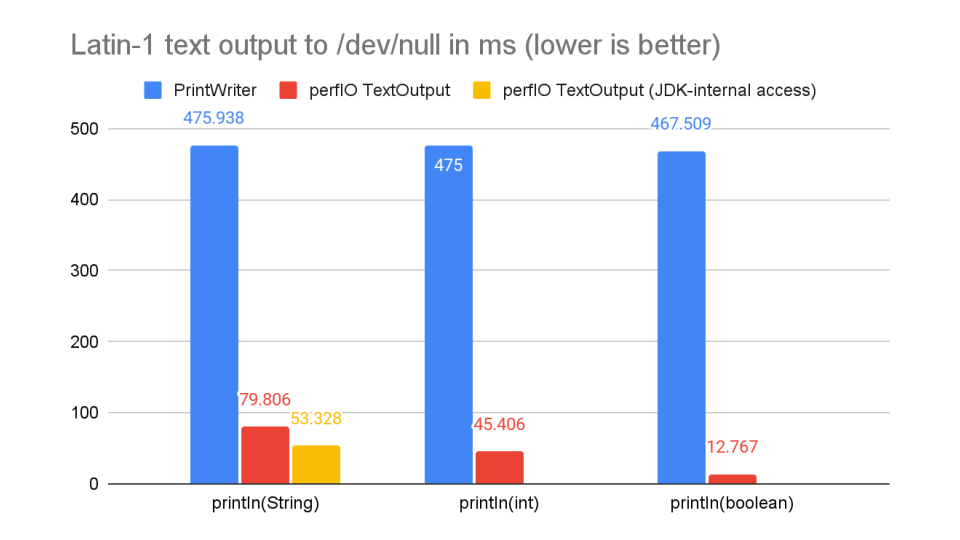
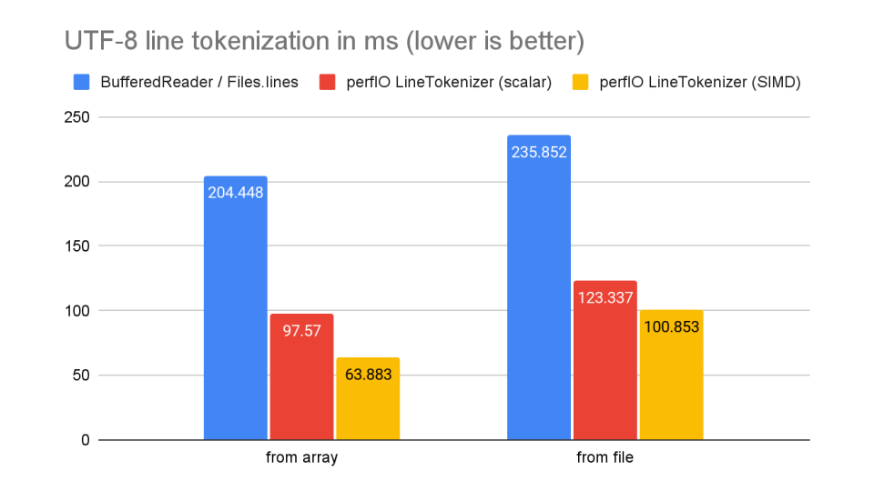
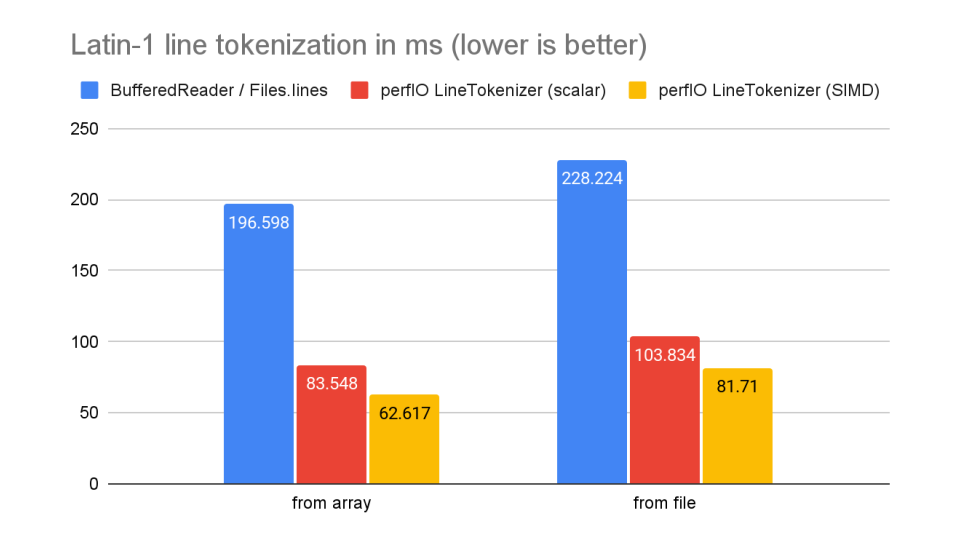
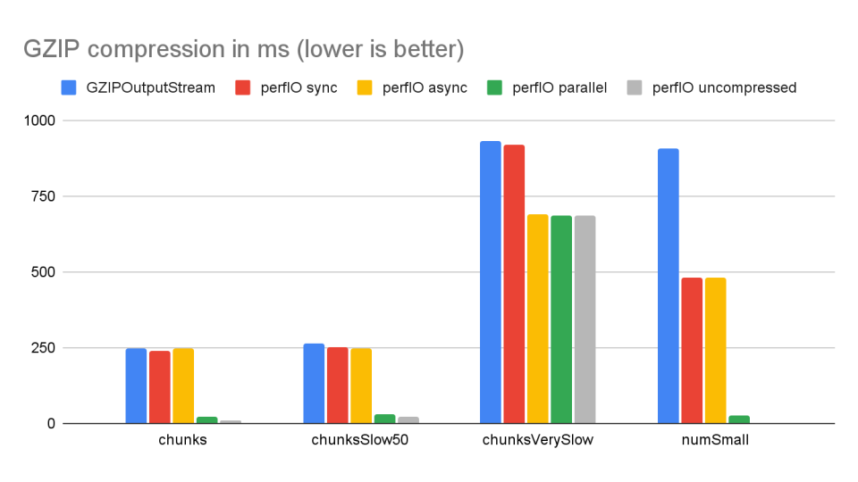

# perfIO - Fast and Convenient I/O for the JVM

## Overview

perfIO provides buffered streaming I/O abstractions for both binary and text data. The design is optimized for performance. The public perfIO classes correspond roughly to the following standard library abstractions:

| perfIO                       | JDK (* and common 3rd-party additions)                                         |
|------------------------------|--------------------------------------------------------------------------------|
| BufferedInput                | BufferedInputStream, ByteArrayInputStream, DataInputStream, LimitedInputStream* |
| BufferedOutput               | BufferedOutputStream, DataOutputStream                                         |
| AccumulatingBufferedOutput   | -                                                                              |
| PipeBufferedOutput           | PipeOutputStream                                                               |
| ArrayBufferedOutput          | ByteArrayOutputStream                                                          |
| LineTokenizer                | BufferedReader + InputStreamReader                                             |
| TextOutput                   | PrintWriter + BufferedWriter + OutputStreamWriter                              |
| GzipBufferedInput            | GZIPInputStream                                                                |
| GzipBufferedOutput           | GZIPOutputStream                                                               |
| FilteringBufferedInput       | FilterInputStream                                                              |
| FilteringBufferedOutput      | FilterOutputStream                                                             |
| AsyncFilteringBufferedOutput | -                                                                              |
| TracingBufferedInput         | CheckedInputStream                                                             |
| TracingBufferedOutput        | CheckedOutputStream                                                            |

## How fast is it?

Reading and writing binary data using a sufficiently large buffer is faster than ByteBuffer, but with the full generality of streaming I/O that does not require a fixed buffer size. Data from the included benchmarks (measured on Temurin OpenJDK 22.0.2 on Linux x68-64) shows typical speed-ups between 3x and 40x in different scenarios compared to standard library abstractions for streaming I/O.








## What makes it fast?

Mostly avoiding things that make the JDK abstractions slow:

- InputStream and OutputStream use the decorator pattern. You typically use multiple nested streams that have to make all of their reads/writes through a standard set of methods that operate on individual bytes or byte arrays. You can easily end up with polymorphic dispatch (because you are always calling methods of the same interface with different implementations) and double buffering.

  By contrast, BufferedInput and BufferedOutput are built around a single buffer (byte array, ByteBuffer or MemorySegment) with a position and limit. All reads and writes are made directly to the buffer. There is no method dispatch overhead no matter how deeply nested the objects are. Almost all reads and writes (except the ones that require re-buffering) are done with a single range check plus increment. Any additional checks are pushed out of the inner loop into the buffering.

- None of the perfIO classes are synchronized or use any locking or memory fences. Streaming I/O is inherently sequential. Multi-threaded use requires synchronization at a higher level anyway, so we do not need to incur any performance penalties from synchronizing in the core abstractions.

- The JDK's Reader and Writer interfaces, as well as the NIO CharsetEncoders and CharsetDecoders are based on char arrays. This was fine at the time they were added, but nowadays the JVM uses a byte-based compact representation for all Strings which are valid Latin-1. In practice, most Strings contain ASCII text, so any char-based design requires conversions back and forth between byte arrays and char arrays.

  perfIO's TextOutput converts directly from Strings to byte data (writing it directly into a BufferedOutput's byte array) and LineTokenizer does the same when reading. This makes use of the more efficient conversions for the common character sets (UTF-8, Latin-1, ASCII) that are built into the String class, Unfortunately the provided API is not sufficient to avoid double buffering in all cases. perfIO can optionally call internal JDK methods to make some common use cases even faster. 

- Output filters can run in asynchronous and parallel mode, and they can exchange blocks of data with the underyling BufferedOutput instead of copying everything.

perfIO also uses both FFM and NIO abstractions where appropriate (depending on performance for the specific use case) and the Vector incubator API (for LineTokenizer).

Another source of performance is not just making the available abstractions fast, but making fast abstractions easily available:

- Reading large files is much faster with memory mapping. While you can always do the mapping manually using the NIO and FFM APIs for more control, perfIO makes the common use case a one-liner.

- Binary formats often use length-prefixed blocks. perfIO provides length-limited views for reading them (at essentially zero cost), and advanced buffer management for writing a length prefix after the content without double buffering or manual buffer management.

## Setup

Add the dependency to your project. Check the [Maven Central page](https://central.sonatype.com/artifact/com.novocode/perfio) for the latest versions and other dependency formats.

```
<dependency>
    <groupId>com.novocode</groupId>
    <artifactId>perfio</artifactId>
    <version>0.1.0</version>
</dependency>
```

The minimum required JDK version is 21 with `--enable-preview` (for the FFM API), or 22 without. There are no other dependencies.

- The Vector incubator API will be used automatically if it has been enabled with `--add-modules jdk.incubator.vector` and the JDK and CPU have appropriate support. Use of the Vector API can be disabled with `-Dperfio.disableVectorized=true`.

- JDK-internal String features will be used automatically if the `java.lang` package has been made accessible with `--add-opens java.base/java.lang=ALL-UNNAMED`. This can be disabled with `-Dperfio.disableStringInternals=true`.

- Unsafe memory access is disabled by default. It can improve the performance in some cases but result in less optimized code in others. Both `-Dperfio.enableUnsafe=true` and `--enable-native-access=ALL-UNNAMED` are required to enable it.

## Basic Usage

A top-level `BufferedInput` or `BufferedOutput` object is instantiated by calling one of the static factory methods in the respective class. It should be closed after use by calling `close()`.

```java
  var out = BufferedOutput.ofFile(Path.of("foo"));
  out.int8(1);
  out.int32(2);
  out.close();

  var in = BufferedInput.ofMappedFile(Path.of("foo"));
  var a = in.int8();
  var b = in.int32();
  in.close();
```

Since Java does not have unsigned integers, the main methods for reading and writing binary data are the signed ones. The only exception is `uint16` which uses `char`, the only unsigned primitive type. Other `uint` methods are convenience wrappers that use a larger signed type.

| Method  | Width                  | Java Type (or surrogate) |
|---------|------------------------|--------------------------|
| int8    | 8 bits signed          | byte                     |
| uint8   | 8 bits unsigned        | (int)                    |
| int16   | 16 bits signed         | short                    |
| uint16  | 16 bits unsigned       | char                     |
| int32   | 32 bits signed         | int                      |
| uint32  | 32 bits unsigned       | (long)                   |
| int64   | 64 bits signed         | long                     |
| float32 | 32 bits floating-point | float                    |
| float64 | 64 bits floating-point | double                   |

The methods for reading and writing multi-byte numeric values require a byte order. Most factory methods set it to `BIG_ENDIAN` by default, but it can be changed at any time with the `order` method. This is consistent with `ByteBuffer` but different from the FFM API (which is mostly intended for interacting with native code and consequently uses the native byte order by default).

All methods except `int8` have additional variants ending in `n` (e.g. `int32n`), `b` and `l` for native, big endian and little endian byte order respectively. These methods are independent of the `BufferedInput`'s or `BufferedOutput`'s current byte order and slightly faster.

### Views

Both `BufferedInput` and `BufferedOutput` can have nested views, but the semantics are different. A `BufferedInput` is always read sequentially, thus creating a view at the current position (using the `limitedView` method) locks the parent until the view is closed. The only method that may still be called while a view is active is `close()` which implicitly closes all active nested views.

A `BufferedOutput` can be written to out of order. This is important for writing binary formats with length prefixes. It is often inconvenient or inefficient to calculate the length without actually writing the data. If the prefix has a fixed size, you can use `reserve` to insert a nested `BufferedOutput` at the current position which can be filled at a later point. You must write exactly the requested amount of data to it before closing it:

```java
  // Write a UTF-8 string with an int32 length prefix
  BufferedOutput b;
  var b2 = b.reserve(4);
  val pos0 = b.totalBytesWritten();
  b.string(...);
  var len = (int)(b.totalBytesWritten() - pos0);
  b2.int32(len);
  b2.close();
```

When the length of the prefix is variable, you can use `defer` instead. This method creates a `BufferedOutput` which shares its buffer management with the parent but is only inserted into the parent once it is closed. Note that this reverses the roles of the two buffers compared to `reserve`:

```java
  // Write a UTF-8 string with an int32 length prefix
  BufferedOutput b;
  val b2 = b.defer();
  b2.string(...);
  b.int32((int)b2.totalBytesWritten());
  b2.close();
```

Both `BufferedInput` and `BufferedOutput` will reuse views by default. This means that you must not access any view after closing it (unless it was explicitly detached by calling `detach()`) because the object and/or its buffer may have been repurposed. This design makes the repeated use of views for writing small amounts of data very efficient. Note that a buffer may have already been reused by the time `close()` returns.

### Text I/O

A `LineTokenizer` can be obtained by calling `lines` on a `BufferedInput` object. It allows you to read a text file line by line. Line tokenization is currently limited to ASCII-compatible encodings, which includes UTF-8 and the ISO-8859 ("Latin") charsets. `LineTokenizer` will use a faster SIMD-based implementation if the Vector API (incubator version as of JDK 22) is available.

A `TextOutput` can be obtained by calling `text` on a `BufferedOutput` object. It allows you to write text data, similar to `java.io.PrintWriter`. Unlike `LineTokenizer` it supports arbitrary character sets, but it is optimized for UTF-8, Latin-1 and ASCII.

## Output Filters

Output filters should extend `FilteringBufferedOutput` (synchronous filtering only) or `AsyncFilteringBufferedOutput` (synchronous/asynchronous/parallel filtering). The only pre-defined filter at the moment is `GzipBufferedOutput`. Instances can be created with the static factory methods in that class.

```java
  // Using parallel gzip compression with default parameters
  var out = BufferedOutput.ofFile(Path.of("foo"));
  var gout = GzipBufferedOutput.parallel(out);
  // write to gout
  gout.close();
```



The relative performance of sync/async/parallel filtering depends primarily on the speed of the main thread that writes the data.

The `chunks` data set writes the same 1 kB byte array repeatedly at maximum speed. This is the ideal case for `java.io.GZIPOutputStream` because it can pass this byte array directly to zlib instead of copying it first. Due to a more efficient hand-off of the output into the underlying `BufferedOutput` and some optimizations, perfIO is still a bit faster in synchronous mode. Async has slightly more overhead and comes out at about the same speed as `GZIPOutputStream`. Parallel filtering (using up to 31 threads in this benchmark) is much faster. In the `chunksSlow50` data set we artificially slow down writing from 10ms to 21ms for uncompressed perfIO. Now asynchronous filtering is starting to show its advantage. Slowing down the main thread much further (`chunksVerySlow`) lets both async and parallel filtering do all the work in the background so that the compression does not cause any slowdown compared to the uncompressed reference.

The `numSmall` benchmark shows a more realistic case where we perform mixed int8/int32/int64 writes. This is much faster in general with perfIO, and so fast in fact that sync vs async filtering makes no difference. (Note that we do not use a `BufferedOutputStream` on top of the `GZIPOutputStream` in any benchmark because it would be slower in the chunk-based ones. The additional buffering would benefit `GZIPOutputStream` in `numSmall` but the difference is less than 5%).

When tuning the async and parallel filters for performance (by using the overloaded factory methods that let you customize all parameters) the main focus should be on avoiding stalls of the filter threads. Even in the case of gzip, which is generally very slow compared to uncompressed writing with perfIO, uneven write performance can lead to stalls that require expensive rescheduling on the thread pool (usually the common `ForkJoinPool`). This can be solved by increasing the filter's partition size and/or queue depth.

### Unchecked Buffer Access

The `UncheckedInput` and `UncheckedOutput` classes contains static methods that allow you to access the raw buffers inside a `BufferedInput` or `BufferedOutput` directly. This can be used to implement abstractions on top of perfIO without any performance penalty, but it is especially useful when implementing filters.
